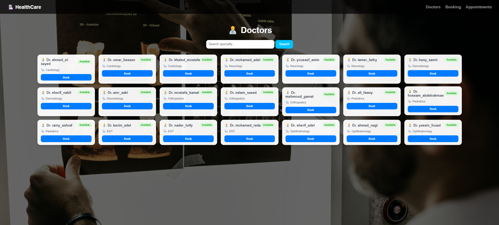

# 🏥 HealthCare System

A simple Hospital Management System built with Django that allows managing doctors, patients, and appointments in an easy and organized way.

---

## 🚀 Features

- 👨‍⚕️ View list of doctors  
- 🧑 View list of patients  
- 📅 Book appointments between doctors and patients  
- 📋 View all booked appointments  
- 🔍 Search doctors by specialty  
- 🔐 User registration with automatic patient creation  

---

## 🛠️ Tech Stack

- Python 3  
- Django Framework  
- HTML / CSS  
- SQLite Database  

---

## 📂 Project Structure
## Project Structure

```text
project-root/
│
├── healthcare/
│   ├── migrations/
│   │   ├── __pycache__/
│   │   ├── 0001_initial.py
│   │   └── __init__.py
│   │
│   ├── templates/
│   │
│   ├── __init__.py
│   ├── admin.py
│   ├── apps.py
│   ├── models.py
│   ├── tests.py
│   ├── urls.py
│   └── views.py
│
├── project/
│   ├── __pycache__/
│   ├── __init__.py
│   ├── asgi.py
│   ├── settings.py
│   ├── urls.py
│   └── wsgi.py
│
├── static/
│   └── css/
│       └── style.css
│
├── interface.png
├── README.md
├── db.sqlite3
├── doctors_data.py
├── manage.py
└── patients_data.py
```
---

## ⚙️ Installation & Setup

1. Clone the repository  
git clone https://github.com/Alaa37885/HealthCare_System.git  
cd HealthCare_System  

2. Create virtual environment  
python -m venv venv  
venv\\Scripts\\activate   # Windows  

3. Install dependencies  
pip install django  

4. Run migrations  
python manage.py makemigrations  
python manage.py migrate  

5. Create superuser  
python manage.py createsuperuser  

6. Run server  
python manage.py runserver  

---

## 🌐 Pages

- /doctors/ → Doctors List  
- /book/ → Book Appointment  
- /appointments/ → View Appointments  
- /patients/ → Patients List  
- /admin/ → Django Admin Panel  

---

## 📸 UI Preview

- 


---

## 💡 Future Improvements

- Dashboard analytics  
- Doctor availability system  
- Appointment status system  
- Django REST API integration  
- Modern UI (Bootstrap / React)  

---

## 👩‍💻 Author

| A'laa Omar |
Aya Karam |
Amira Emad |
Malak Mohammed |
Mariam Ashraf |


---

⭐ If you like this project, please star it!
"""
